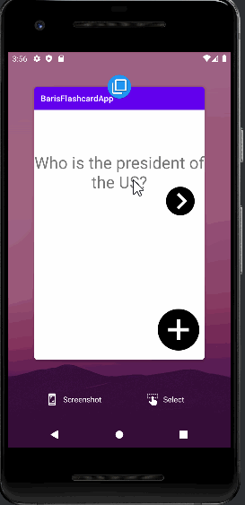
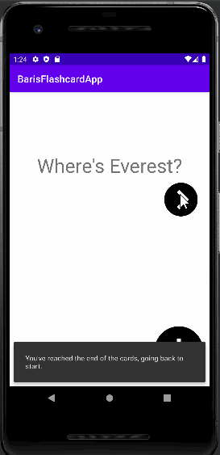
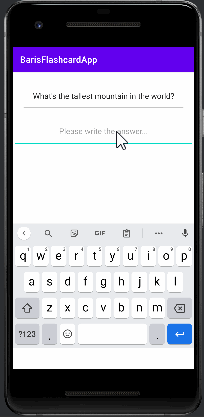

# Baris Guzelsoy Flashcard App 

## Lab 4

### App Description

App has a small icon, has animations while going through the questions and adding a new question. User also sees a reveal animation when the flashcard is tapped along with the answer to the question.

### App Walk-though

 

## Required
- [x] User sees a transition animation when going from the main screen to the add card screen.
- [x] User sees a reveal animation when the flashcard is tapped and the answer is shown
- [x] User sees flashcards animating in / out when the 'next' button is tapped

## Lab 3

### App Description
App is able to go create multiple cards and browse through them.

### App Walk-though

 

## Required
- [x] User can create a card and still see their created card when the app is relaunched.
- [x] User can create muliple cards and browse through all created cards

Lab 2

### App Description
App is able to show a question and give the answer when tapped on the screen

### App Walk-though
 

## Required
- [x] User can click on a ‘+’ button that takes the user to new ‘Add Card Screen’
- [x] The 'Add Card Screen' has a cancel button to take the user back to the main screen
- [x] User can enter and submit a Question and Answer through the 'Add Card Screen'
- [x] User will see the card they just created on the main screen when they press the 'Save Button'
- [x] Push your progress to GitHub!
